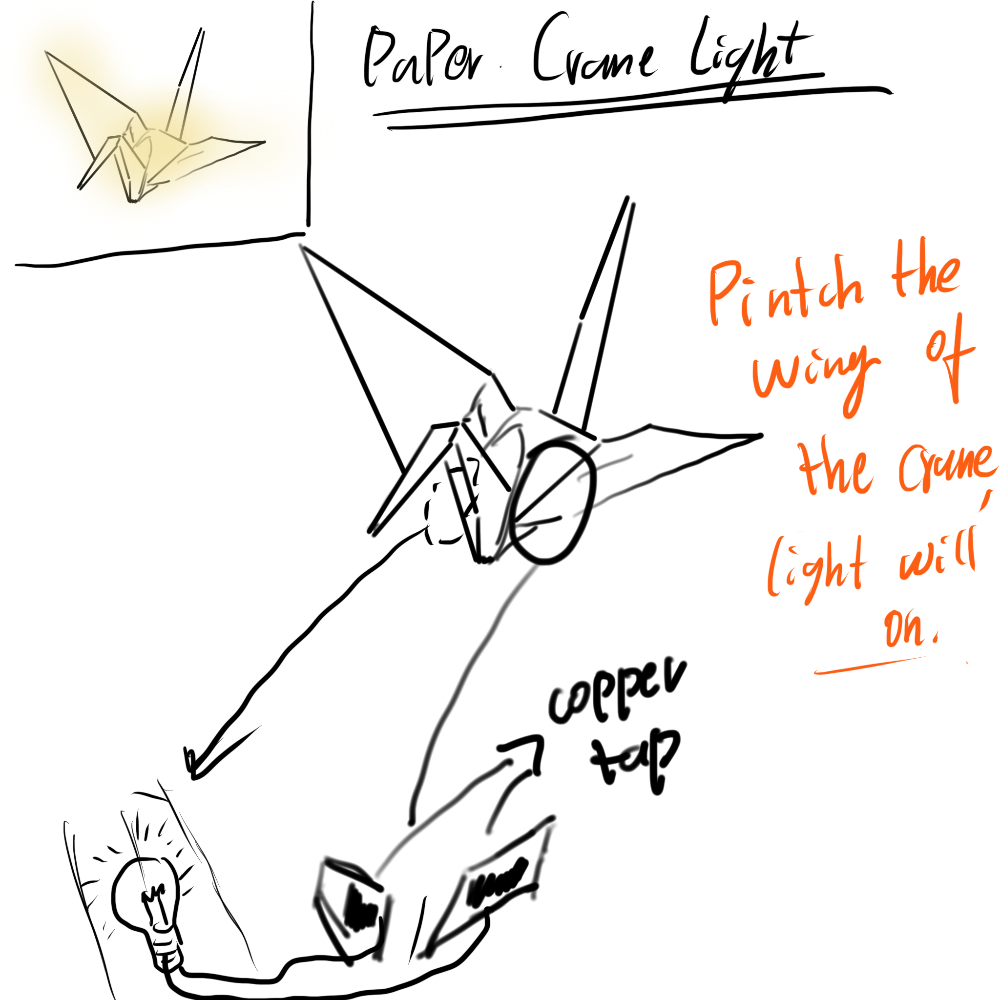
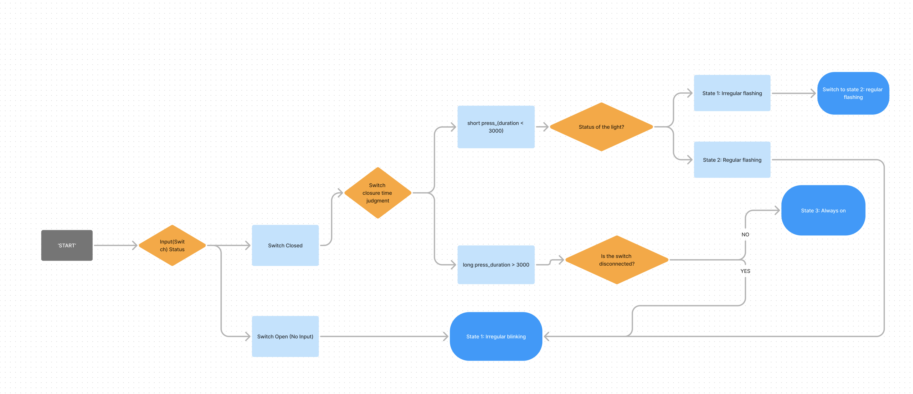
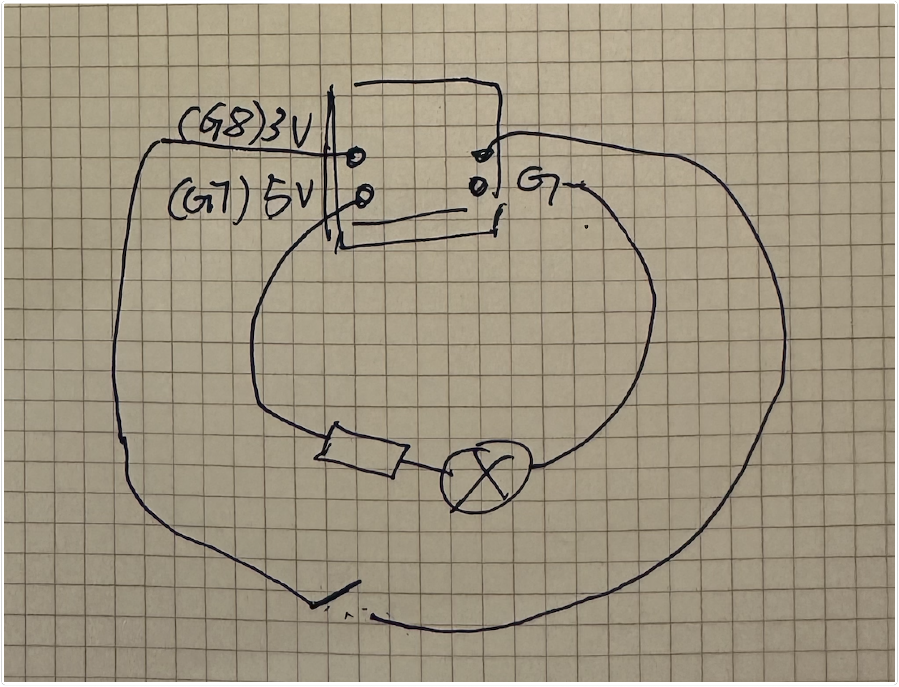

## Assignment #1 Documentation  
  

### Introduction

The initial concept of this project was to create a prototype nightlight using the materials outlined above. This light can mimic the natural phenomenon of lightning with its irregular flashing or maintain a steady and softly bright state when needed. The main goal is to craft a soothing, nature-inspired light pattern that helps induce sleep and provides a stable, gentle light source when necessary. Below are initial concept sketches.

  


### State Diagram

Explain the interactive behaviors of the prototype you created and include a 
state diagram (flowchart) to represent it.  For example, below is an example 
state diagram included in the assignment description:  

  

### Hardware

The following hardware components were used in this project:

- Atom3 board – A microcontroller used to control the light bulb and process button inputs.
- Button (connected to Pin 7) – Acts as an input device to change the states of the system.
- LED Bulb (connected to Pin 8) – The output device that responds with different lighting effects.
- Wires and Breadboard – Used for setting up the circuit to connect the components.
- Origami Crane made of paper
- Copper Tape – Used to adhere and secure non-critical parts of the circuit.
  
Below is a wiring diagram showing how the components are connected. (Insert your wiring image here – can be hand-drawn or software-generated.)

  
  

### Firmware   

The firmware for this project was written in MicroPython, managing the button inputs to control the light's behavior. Below is a key code snippet that illustrates the state transitions based on the button press duration:

``` Python  
# Button press state detection and response logic
if input_pin.value() == 0 and button_pressed_time == 0:
    button_pressed_time = current_time

if input_pin.value() == 1 and button_pressed_time != 0:
    button_released_time = current_time
    press_duration = button_released_time - button_pressed_time
    if press_duration < 1000 and not long_press_detected:
        state = 2 if state == 1 else 1
    button_pressed_time = 0
    long_press_detected = False
```

This section of the code checks the button press duration, distinguishing between a short press and a long press, and changes the state of the light accordingly.

### Physical Components   

As mentioned, we've covered all the electronic components used in the hardware section. This part will mainly discuss the model's appearance. For this prototype, I folded an origami crane out of A4 printer paper. At the critical parts (the button switch area), I first applied copper tape where the wires should be, then soldered metal wires onto the copper strips to ensure stable electric current transmission at critical points. This completes the switch construction, which in this device provides a 0/1 signal. The remaining wires are connected from the model to the Atom3 board and form a closed loop with the bulb, controlled by code directives.

### Project outcome  

The final implementation successfully met the design goals, with the light bulb responding to both short and long button presses (and no press):

Default Mode (State 1): The light flickers irregularly, resembling lightning in a storm.
State 2: A short button press changes the light to flash in a consistent pattern.
State 3: A long button press causes the light to remain constantly on, and releasing the button brings it back to irregular flashing.

Below is a photo of the completed prototype
  

A video walkthrough can be found [here]
