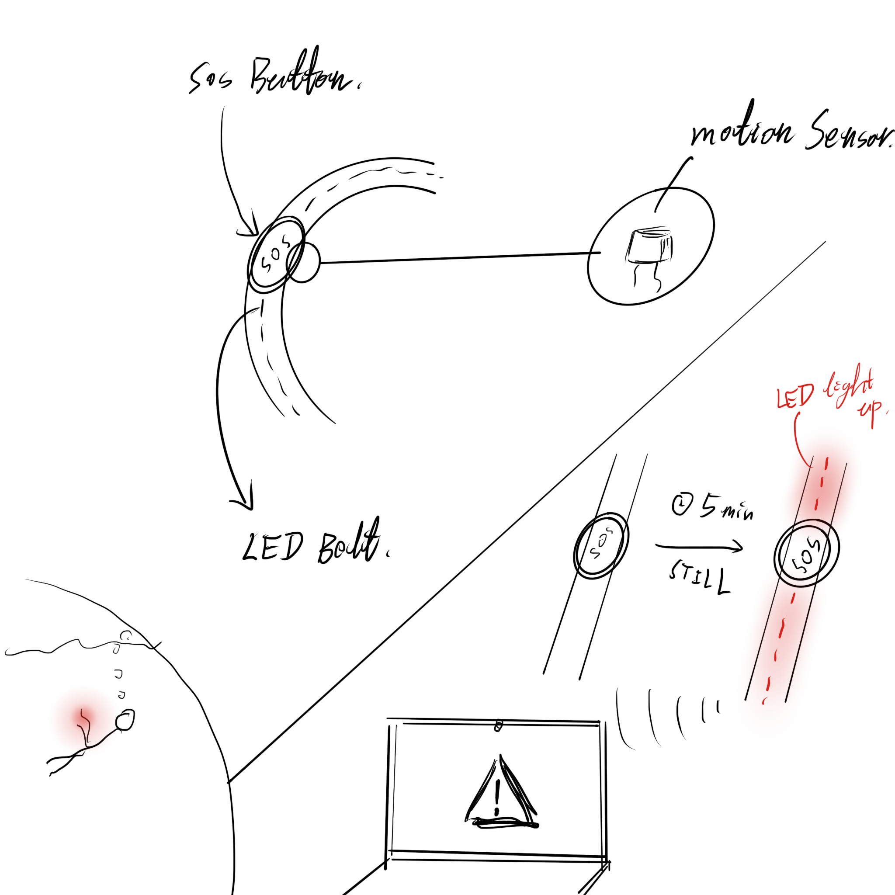
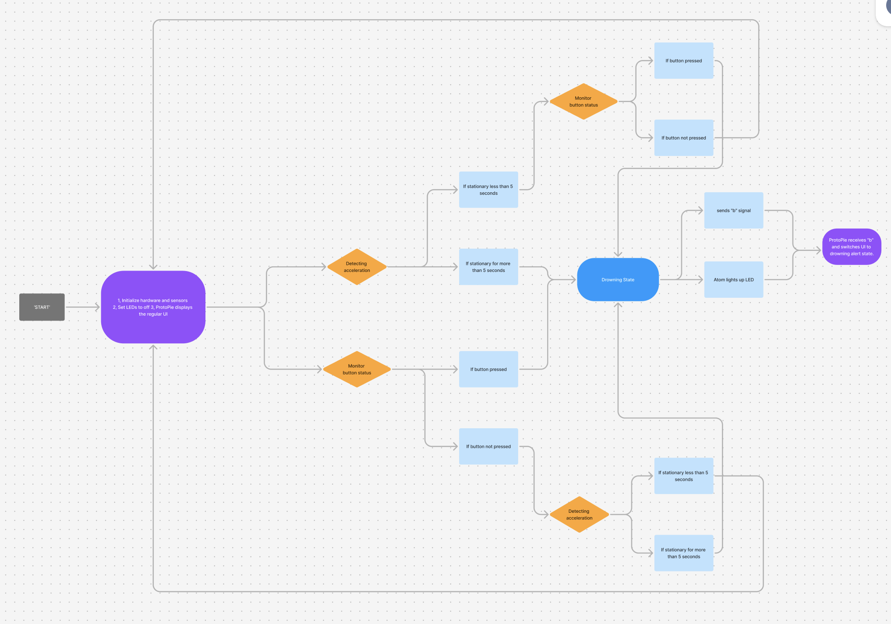
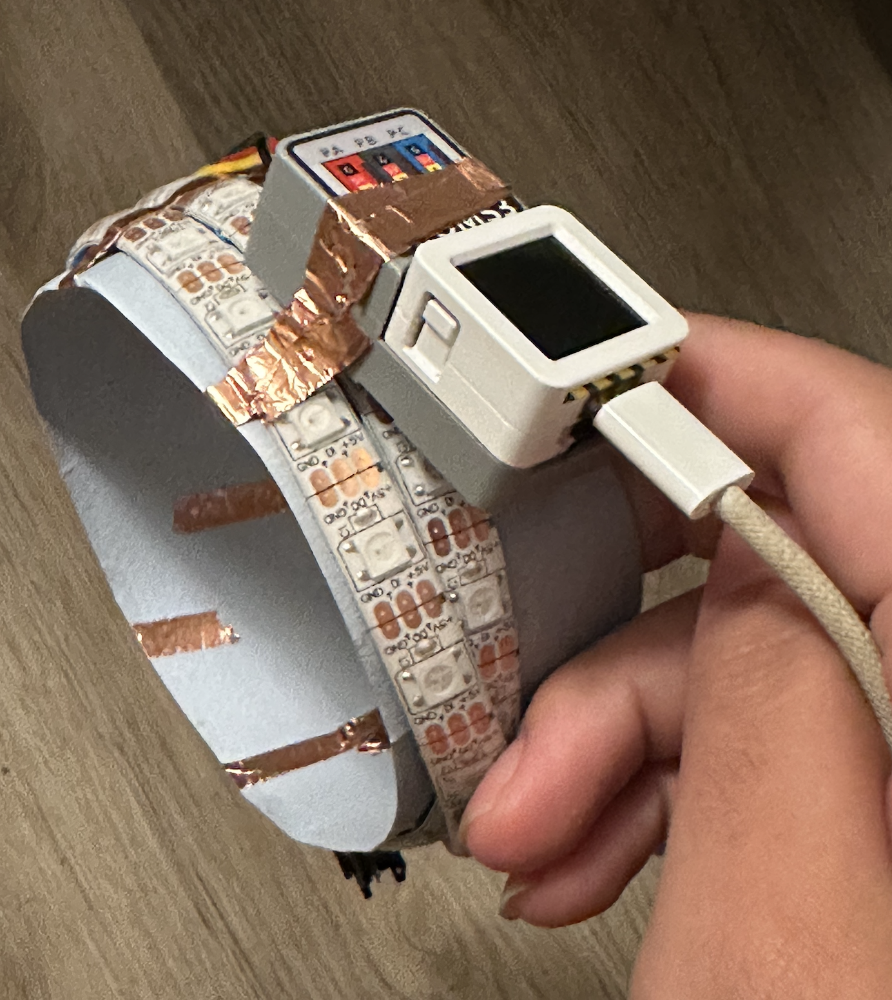
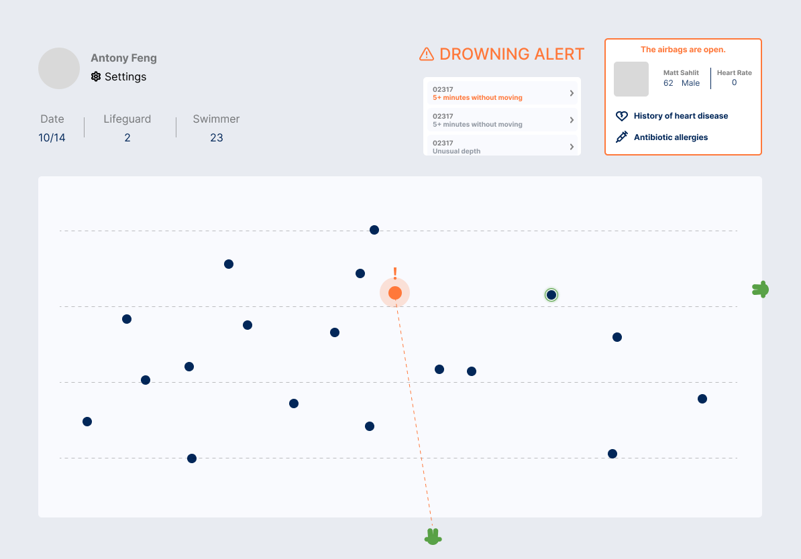
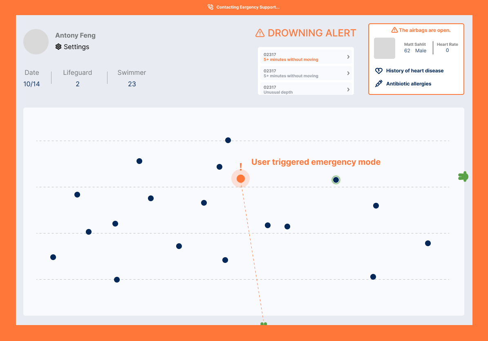

## Assignment #2 Documentation  
  

### Introduction

The purpose of this project is to create an interactive drowning alert wristband prototype using an Atom3 Board integrated with LEDs, an accelerometer, and a button. This wearable device is designed to enhance swimmer safety by providing real-time alerts both visually (through LED lighting) and interactively with a ProtoPie UI interface. If the device detects prolonged inactivity or if the user presses the button, it triggers an alert both on the device and in ProtoPie, simulating an emergency response. Below is an initial concept sketch.

  


### State Diagram

The state diagram below illustrates the interactive behavior of the wristband, showing its progression from monitoring movement to triggering an alert and returning to a normal state.

  


### Hardware

The following hardware components were used in this project:

- **Atom3 Board** – A microcontroller used to control the LED strip and process accelerometer and button inputs.
- **Button (built-in on Atom3)** – Acts as an input device to manually trigger the alert.
- **LED Strip** – Lights up red to signal an emergency and alert the swimmer or nearby lifeguards.
- **Copper Tape and Cardboard Frame** – Used to create a wristband structure, securing the Atom3 and providing a durable yet lightweight frame.

Below is a wiring diagram showing the connections between components.

  


### UI Design
  
  

### Project Outcome

The wristband successfully operates as designed, with the following states:

- **Normal State** – LED is off, continuously monitoring movement.
- **Drowning Alert State** –  LED turns red and “b” is sent when stationary for 5 seconds or when the button is pressed, prompting ProtoPie to display the alert UI.
- **Reset State** – If no inactivity or button press for 5 seconds, “a” is sent to reset ProtoPie’s UI to the normal state.


### Firmware   

The firmware for this project was written in MicroPython, designed to manage both accelerometer data and button inputs, triggering alerts when necessary. Below is a key code snippet that demonstrates how the program detects inactivity and button presses to transition between states:
————————————————————————————————
This code snippet handles the detection of prolonged inactivity or button presses, changing LED states and sending signals (“b” for alerts, “a” to reset) to ProtoPie to manage the UI response.

```Python
import os, sys, io
import M5
from M5 import *
import time
from hardware import *

# Initialize M5 device and parameters
M5.begin()
acceleration_threshold = 1.1  # Threshold for inactivity
stationary_time_limit = 5000  # Stationary time limit in milliseconds
start_stationary_time = None  # Time when stationary state begins
stationary = False  # Flag indicating if device is in a stationary state
last_b_trigger_time = time.ticks_ms()  # Timer for last 'b' trigger

# Configure LED strip
rgb_strip = RGB(io=38, n=30, type="SK6812")
rgb_strip.fill_color(0x000000)  # Initialize with all LEDs off

while True:
    M5.update()
    imu_data = Imu.getAccel()
    acc_x, acc_y, acc_z = imu_data
    total_acceleration = (acc_x ** 2 + acc_y ** 2 + acc_z ** 2) ** 0.5

    # Inactivity detection
    if total_acceleration < acceleration_threshold:
        if not stationary:
            start_stationary_time = time.ticks_ms()
            stationary = True
        else:
            elapsed_time = time.ticks_ms() - start_stationary_time
            if elapsed_time > stationary_time_limit:
                print("Drowning detected!")
                rgb_strip.fill_color(0xFF0000)  # Red LED alert
                print('b')
                last_b_trigger_time = time.ticks_ms()  # Reset 'b' timer
    else:
        stationary = False
        rgb_strip.fill_color(0x000000)  # Turn off LEDs

    # Button press detection
    if BtnA.wasPressed():
        rgb_strip.fill_color(0xFF0000)
        print('b')
        last_b_trigger_time = time.ticks_ms()  # Reset 'b' timer

    # Trigger "a" if no "b" signal for 5 seconds
    if time.ticks_ms() - last_b_trigger_time > 5000:
        print('a')
        last_b_trigger_time = time.ticks_ms()  # Reset timer

    time.sleep_ms(100)


